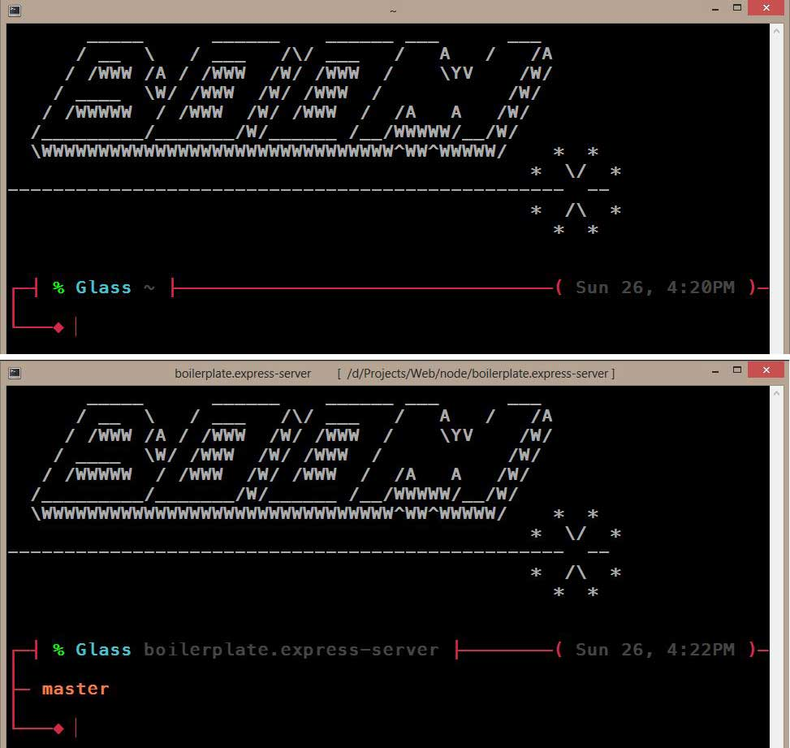

# Boom

A custom theme for ZSH



---

## Installation

There are a couple ways to install. Note that I'll use `BOOM_THEME` as the name
of the directory path where you cloned or downloaded this repo:

- Download the repo and then
  - **Option 1**: In `~/.zshrc` add `source BOOM_THEME/skin.zsh-theme`.
  - **Option 2**: If you're using *Oh-My-Zsh* make sure to place the source in
  `~/.oh-my-zsh/custom/themes/BOOM_THEME`. You can then set this in your `.zshrc`
  ```
  ZSH_THEME="BOOM_THEME/skin"
  ```
